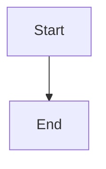

# Troubleshooting Guide

## Important: Use `beautiful-mermaid` Code Blocks

Make sure you're using `beautiful-mermaid` (not `mermaid`) as the code block type:

````markdown
```beautiful-mermaid
graph TD
  A --> B
```
````

Standard `mermaid` blocks will use Obsidian's built-in renderer. Only `beautiful-mermaid` blocks use this plugin.

---

If your diagrams still don't render correctly, follow these steps:

## Step 1: Rebuild and Reload

1. **Rebuild the plugin:**
   ```bash
   cd obsidian-plugin
   npm run build
   ```

2. **Reload Obsidian:**
   - Press `Ctrl+R` (or `Cmd+R` on Mac) to reload Obsidian
   - Or go to Settings → Community Plugins → Disable and re-enable "Beautiful Mermaid"

## Step 2: Check the Console

1. **Open the Developer Console:**
   - Press `Ctrl+Shift+I` (or `Cmd+Option+I` on Mac)
   - Or go to Settings → Advanced → Enable Developer Tools

2. **Look for these log messages:**
   - `Beautiful Mermaid Plugin: Loading...`
   - `Beautiful Mermaid Plugin: Library loaded successfully`
   - `Beautiful Mermaid Plugin: Processing mermaid block`
   - `Beautiful Mermaid Plugin: Rendering with theme: ...`
   - `Beautiful Mermaid Plugin: Calling renderMermaid...`
   - `Beautiful Mermaid Plugin: Got SVG, length: ...`

3. **Check for errors:**
   - Any red error messages?
   - Does it say "Library failed to load"?
   - Any import errors?

## Step 3: Verify the Plugin is Running

1. **Check if the processor is being called:**
   - Create a new Mermaid code block
   - Check the console for "Processing mermaid block" message
   - If you don't see this, the processor isn't being registered

2. **Check the rendered element:**
   - Right-click on a Mermaid diagram
   - Select "Inspect Element"
   - Look for `data-beautiful-mermaid="true"` attribute
   - If it's missing, our renderer didn't run

## Step 4: Check Dependencies

1. **Verify beautiful-mermaid is installed:**
   ```bash
   cd obsidian-plugin
   npm list beautiful-mermaid
   ```

2. **If it's missing, install it:**
   ```bash
   npm install beautiful-mermaid
   # Or from GitHub:
   npm install github:lukilabs/beautiful-mermaid
   ```

3. **Rebuild:**
   ```bash
   npm run build
   ```

## Step 5: Test with a Simple Diagram

Try this simple diagram to test:

````markdown

````

Check the console to see if:
- The processor is called
- renderMermaid is called
- An SVG is generated

## Step 6: Check Obsidian Settings

1. **Make sure the plugin is enabled:**
   - Settings → Community Plugins
   - "Beautiful Mermaid" should be ON

2. **Check if there are conflicts:**
   - Disable other Mermaid-related plugins temporarily
   - Some themes or plugins might override code block rendering

## Step 7: Manual Test

1. **Open the console**
2. **Run this command to test the library:**
   ```javascript
   const { renderMermaid, THEMES } = await import('beautiful-mermaid');
   console.log('THEMES:', Object.keys(THEMES));
   const svg = await renderMermaid('graph TD; A --> B', THEMES['tokyo-night']);
   console.log('SVG:', svg.substring(0, 100));
   ```

   If this fails, the library isn't bundled correctly.

## Common Issues

### Issue: "Library failed to load"
**Solution:** 
- Check if `beautiful-mermaid` is in `node_modules`
- Rebuild the plugin: `npm run build`
- Check the console for import errors

### Issue: No console logs appear
**Solution:**
- The plugin might not be loading
- Check Settings → Community Plugins
- Try disabling and re-enabling the plugin
- Restart Obsidian

### Issue: Console shows "Processing" but diagrams look native
**Solution:**
- Check if `renderMermaid` is actually being called
- Look for "Calling renderMermaid" in console
- If missing, there might be an error in the render function
- Check for any error messages after "Processing mermaid block"

### Issue: SVG is generated but looks wrong
**Solution:**
- Check the theme setting in plugin settings
- Try switching themes
- Check if the SVG has the `data-beautiful-mermaid` attribute
- Verify the SVG contains theme colors (not default Mermaid colors)

## Still Not Working?

1. **Check the built file:**
   - Open `main.js` in the plugin directory
   - Search for "beautiful-mermaid" - it should be bundled
   - If not, the library isn't being included

2. **Check file permissions:**
   - Make sure Obsidian can read the plugin files
   - Check that `main.js`, `manifest.json`, and `styles.css` exist

3. **Try a fresh install:**
   - Remove the plugin from `.obsidian/plugins/beautiful-mermaid/`
   - Rebuild: `npm run build`
   - Copy files again or recreate symlink
   - Enable plugin in Obsidian

4. **Report the issue:**
   - Include console logs
   - Include error messages
   - Include Obsidian version
   - Include Node.js version (`node --version`)
